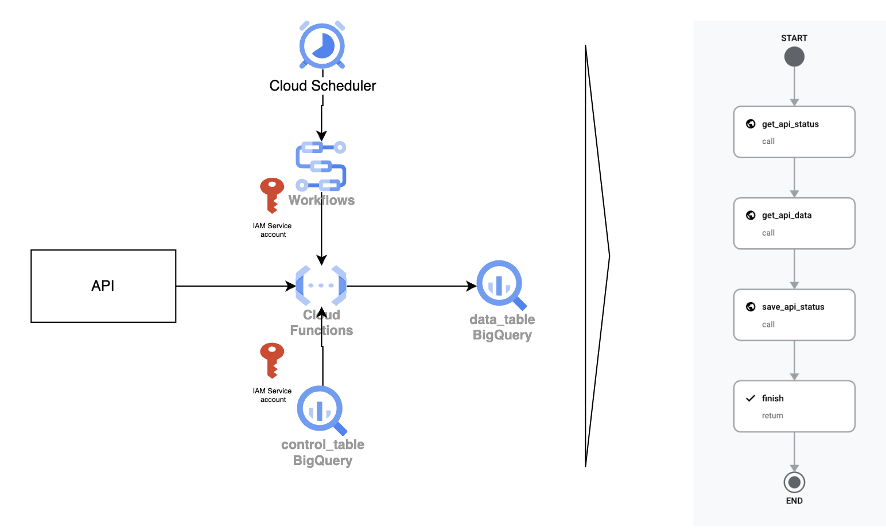

# Paginated API data ingestion into BigQuery

This sample code allow you to create an ingestion mechanism using Workflows, Cloud Functions and an auxiliary control table in BigQuery, to continuosly ingest data from a paginated API. The workflow will invoke the same sample function passing a parameter specifying which step should run: 
1. Get current token from BQ control table
2. Retrieve and save the data from API using the current token
3. Save the new toke acquired from the API

**Sample IAM Roles provided here are for demonstration purposes only must be adjust to comply with least-privilege best practices.**



* Create BigQuery table for storing the data. Replace YOUR_DATASET_NAME
````sql
CREATE TABLE `YOUR_DATASET_NAME.api_data`
(
  a STRING,
  b STRING,
  c STRING
);
````

* Create BigQuery table for saving state. Replace YOUR_DATASET_NAME
````sql
CREATE TABLE `YOUR_DATASET_NAME.api_control`
(
  datetime TIMESTAMP,
  token STRING,
  records STRING
);
````

* Create a Cloud Function:
  * Use the file [requirements.txt](requirements.txt)
  * Use the file [main.py](main.py). Replace YOUR_PROJECT_NAME and YOUR_DATASET_NAME
  * Assign a Service account with permissions to read and write into your BQ tables (e.g. roles/bigquery.dataEditor))
 
* Create a Worflow using [workflow.yaml](workflow.yaml)
    * Assign a Service account with permissions to invoke your Cloud Function (e.g. roles/run.invoker)
 
* Create a Cloud Scheduler to run continuosly every X amount of time your workflow:
  * To run every minute use the cron expression * * * * *
  * To run every hour at 0 minutes, use the cron expression 0 * * * *
  * Assign a Service account with permissions to invoke the workflow (e.g. roles/workflows.invoker)
