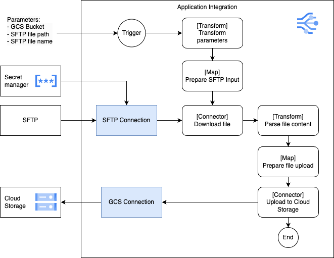
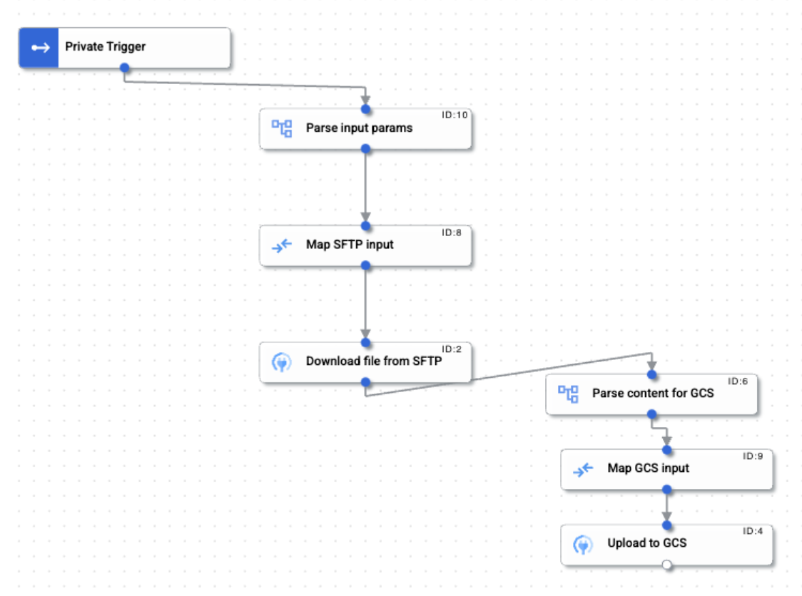

# Sample data ingestion from SFTP to Cloud Storage

How many times have you had the need to ingest data into your lake from an SFTP. Here is a sample integration workflow for it.

1. Create a [GCS Connection](https://cloud.google.com/integration-connectors/docs/connectors/cloudstorage/configure).
2. Create a [SFTP Connection](https://cloud.google.com/integration-connectors/docs/connectors/sftp/configure).
3. Create an integration using the [sample integration template](ingest_from_sftp-v1.json).
4. Configure the SFTP and GCS connections in your integration.
5. Run the integration and provide the params:
* Source filepath from SFTP
* Source file name from SFTP
* Target GCS bucket. File name is assigned based on the source, file path is setup as sftp_ingest (you can modify it)

