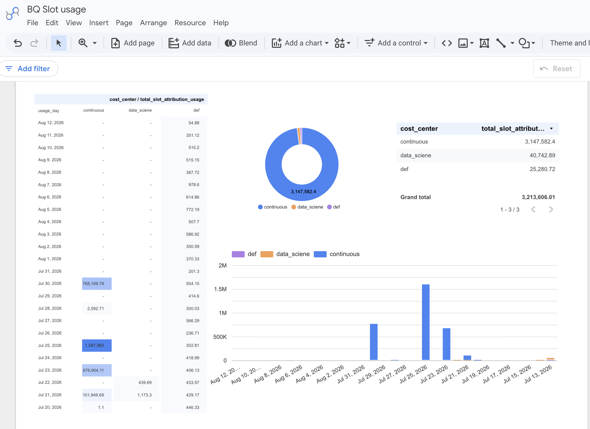

# BigQuery Reservation Slot attribution

This script uses GCP Billing export in BigQuery to analyze the amount of slots used by a [reservation with a label applied](https://docs.cloud.google.com/bigquery/docs/adding-labels#reservation). 
This allows to gain visibility about utilization of the reservation. 
Similar calculation can be achieved by aggregating the slots_used_ms from [BQ Information schema](https://docs.cloud.google.com/bigquery/docs/information-schema-intro)



```sql
create or replace table gcp_billing.bq_slot_attribution as
SELECT
  DATE(t0.usage_start_time) AS usage_day,
  labels.value AS cost_center,
  SUM(t0.usage.amount) AS total_slot_attribution_usage,
  t0.usage.unit AS unit
FROM
  `gcp_billing`.`gcp_billing_export_resource_v1_019CAE_7D7330_15385C`
    AS t0,
  UNNEST(t0.labels) AS labels
WHERE
  t0.sku.description = 'Analysis Slots Attribution'
  AND labels.key = 'cost_center'
  AND DATE(t0.usage_start_time) >= DATE_SUB(CURRENT_DATE(), INTERVAL 30 DAY)
GROUP BY usage_day, cost_center, unit
ORDER BY usage_day;
```
