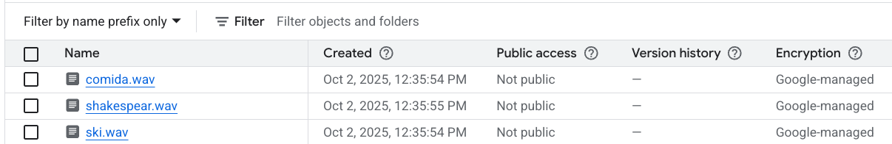
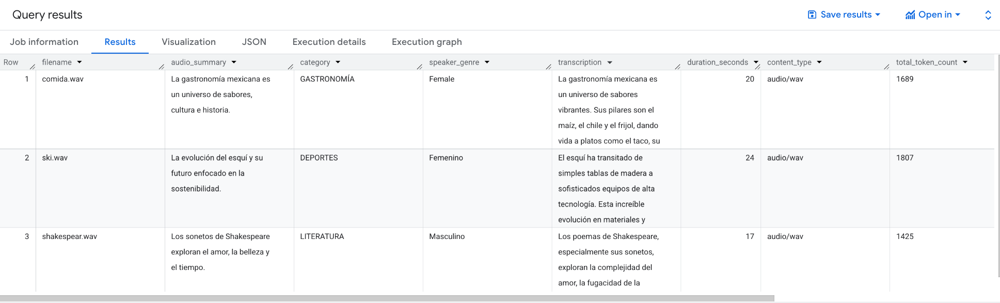

# BigQuery ML Audio analytics with SQL and Gen AI

How to extract relevant information easily from audios using BigQuery [AI.GENERATE_TABLE](https://cloud.google.com/bigquery/docs/reference/standard-sql/bigqueryml-syntax-generate-table?hl=es-419) SQL function. Sample created from [Documentation](https://cloud.google.com/bigquery/docs/transcribe?hl=es-419)

## 0. Upload audios to Cloud Storage


## 1. Create BigQuery connection to Vertex
[Documentation](https://cloud.google.com/bigquery/docs/remote-functions#create_a_connection) to create a connection to Vertex and Cloud Storage in BigQueryML. Also, provide necessary permissions.

## 2. Setup Object table and BQML integration with Gemini
````sql
### Create object table
CREATE OR REPLACE EXTERNAL TABLE `objects.audios`
  WITH CONNECTION `us.gemini`
  OPTIONS (
    object_metadata = 'SIMPLE',
    uris =
      ['gs://STORAGE_PATH/*']);

### Create Model
CREATE OR REPLACE MODEL `objects.gemini_pro`
  REMOTE WITH CONNECTION `us.gemini`
  OPTIONS (ENDPOINT = 'gemini-2.5-pro');
````

## 3. Create a table with the insights
Using the AI.GENERATE_TABLE, a prompt and the object table, extract information from each of the audios in a tabular fashion. The prompt will extract:
- audio_summary
- category
- speaker_genre
- duration_seconds
- transcription

````sql
CREATE OR REPLACE TABLE `objects.audio_insights` AS
SELECT
  split(uri,'/')[offset(4)] filename
  , audio_summary
  , upper(category) category
  , speaker_genre
  , transcription
  , duration_seconds
  , content_type
  , full_response.usage_metadata.total_token_count total_token_count
FROM
AI.GENERATE_TABLE( 
  MODEL `objects.gemini_pro`,
  (
    SELECT 
      ('''
          Describe the following audio in spanish. Extract the items:  
          - audio_summary: 10 words summary
          - category: category of what the audio is talking, e.g. sports, culture, food, art, étc.
          - speaker_genre
          - duration_seconds
          - transcription
        ''',
        OBJ.GET_ACCESS_URL(ref, 'r')
      ) AS prompt
    , *
    FROM
   `objects.audios` ),
  STRUCT ( "audio_summary STRING, category STRING, speaker_genre STRING, duration_seconds INT64, transcription STRING" AS output_schema )
);
````

# 4. View insights
Query the table created to view the insights. The output also includes metadata from BigQuery Job with the token utilization count.

````sql
Select * from objects.audio_insights;
````
