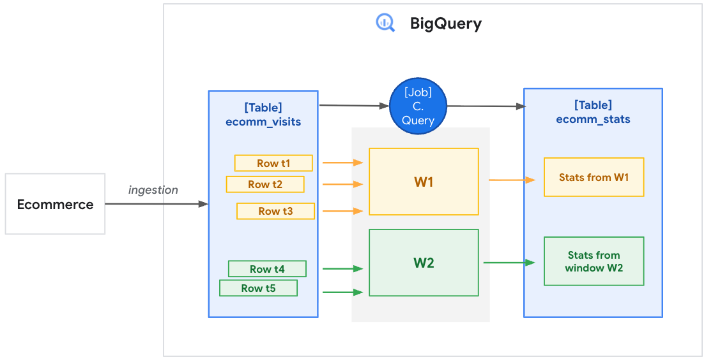

# Transitioning from Batch to Real-Time Analytics with BigQuery Continuous Queries
By Luis Gerardo Baeza

This notebook demonstrates how to migrate traditional batch-based user and unique visitor calculations into a real-time, continuous streaming pipeline using BigQuery Continuous Queries (CQ).

[BQ Docs](https://docs.cloud.google.com/bigquery/docs/continuous-queries-introduction)

## Architecture Overview
Based on our pipeline design, here is the flow of data:
- Ingestion: E-commerce simulated visits stream in real-time from our website into the ecomm_visits table.
- Continuous Processing (CQ): A BigQuery Continuous Query actively listens to incoming rows, processes them in temporal windows (e.g., grouping events into 1-minute blocks), and calculates metrics.
- Destination: The aggregated statistics are written continuously into the ecomm_stats destination table.

Refer to the [BigQuery Colab Notebook](bq_cont_queries.ipynb) for implementation details
