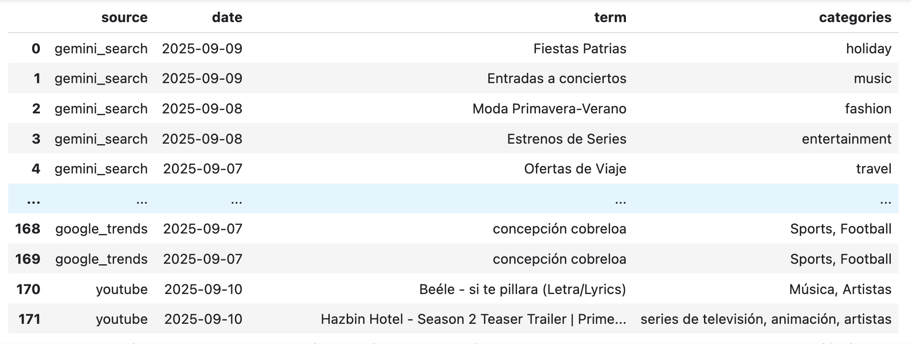

# Acquire trending topics using Gemini, Youtube API and Google Trends
On this sample, we show how to retrieve insights about trending topics. 
Beware this sample considers data from Chile, for the latest trends, and is provided as a sample.

You will need to provide your own Youtube API Key on the constants.

This will create a dataset called demo_trends with 3 tables:
- trends_gemini
- trends_youtube
- trends_google

The final output is a view that joins all three tables to consolidate the trends and categories

