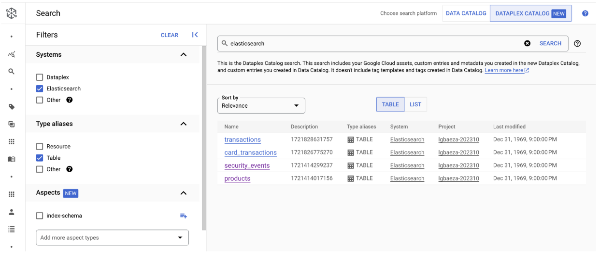

# Dataplex integration with Elastic Search
Sample Cloud Function source code to crawl Elasticsearch indices and populate the Dataplex Catalog.

# Implementation steps
## 1. Deploy Elasticsearch through GCP Marketplace or prepare your own instance
## 2. Create cloud function with provided zip_file and following environment variables:
* ES_API_KEY: Elastic api key
* ES_API_KEY_ID: Elastic api key id
* ES_ENDPOINT: Elastic endpoint
* GCP_LOCATION_ID: us-central1
* GCP_PROJECT_ID

## 3. Run the cloud function and preview the indices as Dataplex As Entries

